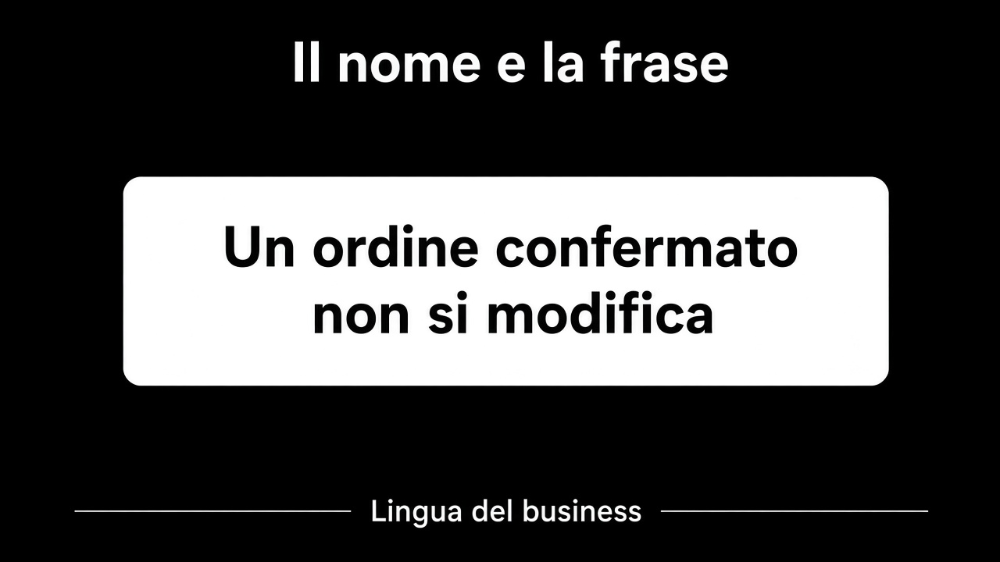

# 4. Il test parla la lingua del business

*La frase è il nome*

← [Lo use case con adapter in memoria](3.use-case-in-memoria.md) · [Indice](README.md) · [Quando il test chiede di cambiare design →](5.quando-il-test-chiede-design.md)

---

## Si legge come una regola

Il [percorso 2](../2.DDD-strategico/1.parole-esempi-ambiguita.md) raccoglieva frasi falsificabili. Il test è il posto dove quella frase diventa verifica. Il nome non descrive il meccanismo: **è** la frase.

```text
un_ordine_confermato_non_si_modifica
un_ordine_vuoto_non_si_conferma
un_confermato_non_torna_in_bozza
```

`testConferma` non dice niente. `testSetStato` dice che stai ancora testando un setter. `shouldThrowWhenInvalid` è il framework che parla, non Vendite.



## Cosa resta nel corpo

Dato, quando, allora — nella lingua del dominio. `Quantita(2)`, `conferma()`, rifiuto. Non `assertEquals(3, ordine.getRighe().size())` se la frase era sul totale. Si asserisce ciò che la regola protegge, non ciò che è comodo da leggere.

Un test così è documentazione. Un nuovo canale — un job, una coda — legge i nomi e sa cosa non deve rompere. Se i nomi sono tecnici, la documentazione è un commento, e i commenti mentono.

## Cosa resta fuori

I test che, anche col nome giusto, chiedono un altro design: capitolo 5. Quelli che non andrebbero scritti: capitolo 6.

E non è il capitolo sul BDD come cerimonia. Tre parole in inglese in cima a ogni metodo non fanno una frase. La frase è italiana, o è la lingua del team: è la stessa del percorso 2.

Se il nome è giusto e il setup è una pagina, il problema non è il nome.

---

← [3. Lo use case con adapter in memoria](3.use-case-in-memoria.md) · [Indice](README.md) · **Avanti:** [5. Quando il test chiede di cambiare design →](5.quando-il-test-chiede-design.md)
