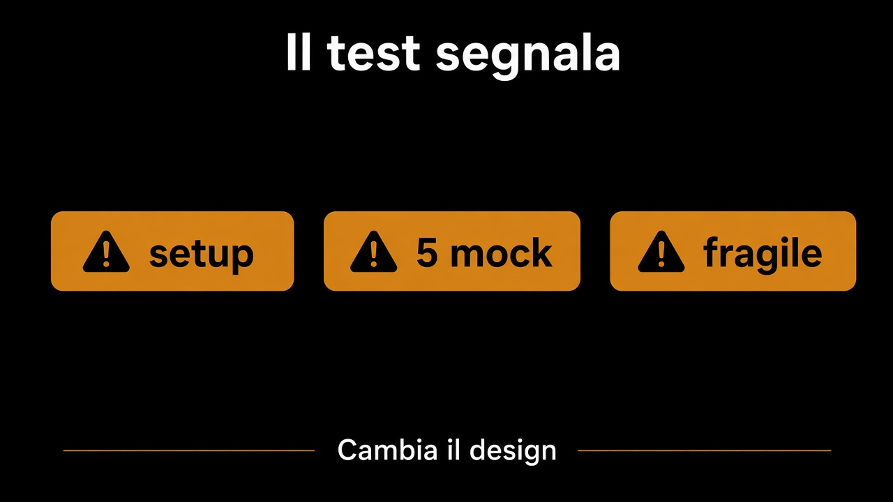

# 5. Quando il test chiede di cambiare design

*Trenta righe di setup sono un segnale*

← [Il test parla la lingua del business](4.lingua-del-business.md) · [Indice](README.md) · [Cosa non testare →](6.cosa-non-testare.md)

---

## Cosa sta dicendo il bordo

Un test che per dire «un confermato non si modifica» deve costruire un grafo, aprire una sessione, farsi cinque mock, è un test onesto: ti sta dicendo che la regola non sta in un posto solo.

| Sintomo | Di solito |
|---|---|
| Setup di una pagina | l'aggregate è troppo grosso, o non è un aggregate |
| Cinque mock | lo use case sa troppi dettagli, o non ci sono port |
| Test fragile: un rename lo rompe | stai asserendo la forma, non la frase |
| Solo con il database su | il dominio non si monta da solo |

Nessuno di questi si sistema con una libreria migliore. Si sistema spostando la regola, stringendo il port, o ammettendo che [due cose dovevano essere una](../3.DDD-tattico/4.aggregate.md).

## Cosa non fare

Non «semplificare il test» nascondendo il setup in un helper da ottanta righe. L'helper è il fango, spostato. Non disattivare il test perché flaky: flaky è un adapter che non è un contratto, o un tempo che non è nel port.

A volte il test è lungo perché la frase è lunga. «Non confermare se il catalogo ha dismesso e il magazzino è sotto scorta» è due contesti. Spezzala. Lo use case coordina; ogni pezzo ha il suo test corto.

## Cosa resta fuori

La lista di ciò che non merita un test: capitolo 6.

Il test che chiede design è il più utile che hai. Quello che copre una riga per arrivare al cento per cento è il prossimo da non scrivere.

---

← [4. Il test parla la lingua del business](4.lingua-del-business.md) · [Indice](README.md) · **Avanti:** [6. Cosa non testare →](6.cosa-non-testare.md)
