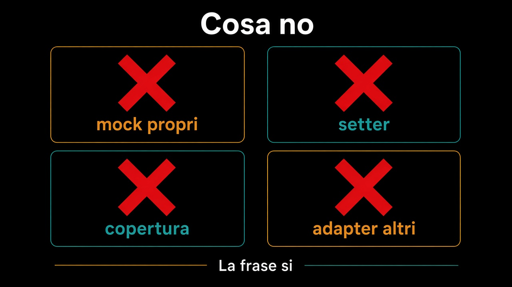

# 6. Cosa non testare

*La copertura non è la frase*

← [Quando il test chiede di cambiare design](5.quando-il-test-chiede-design.md) · [Indice](README.md)

---

## Quattro no

**Mock del proprio codice.** Un mock di `Ordine` per testare `ConfermaOrdine` dice che l'ordine è un dettaglio. Non lo è. Si usa l'ordine vero, o si ammette che lo use case è vuoto.

**Asserzioni sui getter.** `getStato() == CONFERMATO` dopo `setStato`. Hai testato il framework. La frase era `conferma()` e il rifiuto di `aggiungiRiga`.

**Copertura come obiettivo.** Il cento per cento sulle righe dell'adapter SQL non protegge un invariante. Protegge una colonna. Si testa il contratto, non ogni ramo del driver.

**I test sugli adapter di altri.** Il client HTTP del corriere lo testa il corriere. Tu testi che, al tuo port, un esito abbia un nome — e che lo use case lo tratti.

## Cosa sì, in una riga

Il dominio, da solo. Il port, su due adapter. Lo use case, in memoria. I nomi sono frasi. Il resto è rumore, o è design che ancora non è arrivato.

## Cosa succede ora

I bordi tengono e si misurano. Resta da farli rispettare *tra* i pezzi: un contesto che diventa un modulo, dipendenze che non tornano indietro, uno schema che non si condivide di nascosto. È il [percorso sui moduli](../10.Moduli/README.md).

---

## Percorso completo

1. [Il dominio si testa senza niente](1.dominio-senza-niente.md)
2. [Un port, due adapter, un test](2.un-port-due-adapter.md)
3. [Lo use case con adapter in memoria](3.use-case-in-memoria.md)
4. [Il test parla la lingua del business](4.lingua-del-business.md)
5. [Quando il test chiede di cambiare design](5.quando-il-test-chiede-design.md)
6. **Cosa non testare** (sei qui)

← [Torna all'indice](README.md) · [Mappa dei percorsi](../README.md)
